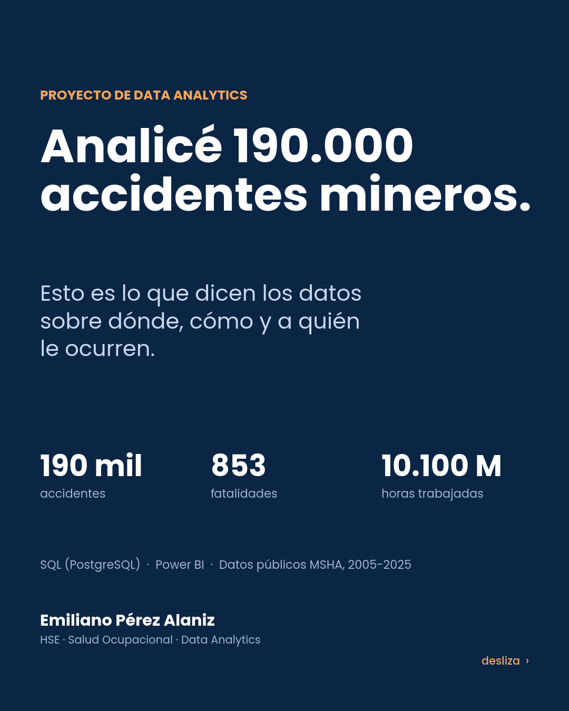
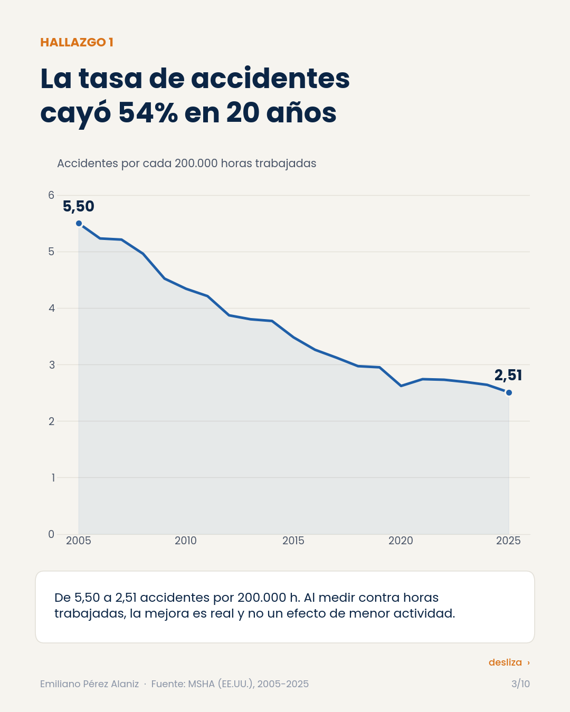
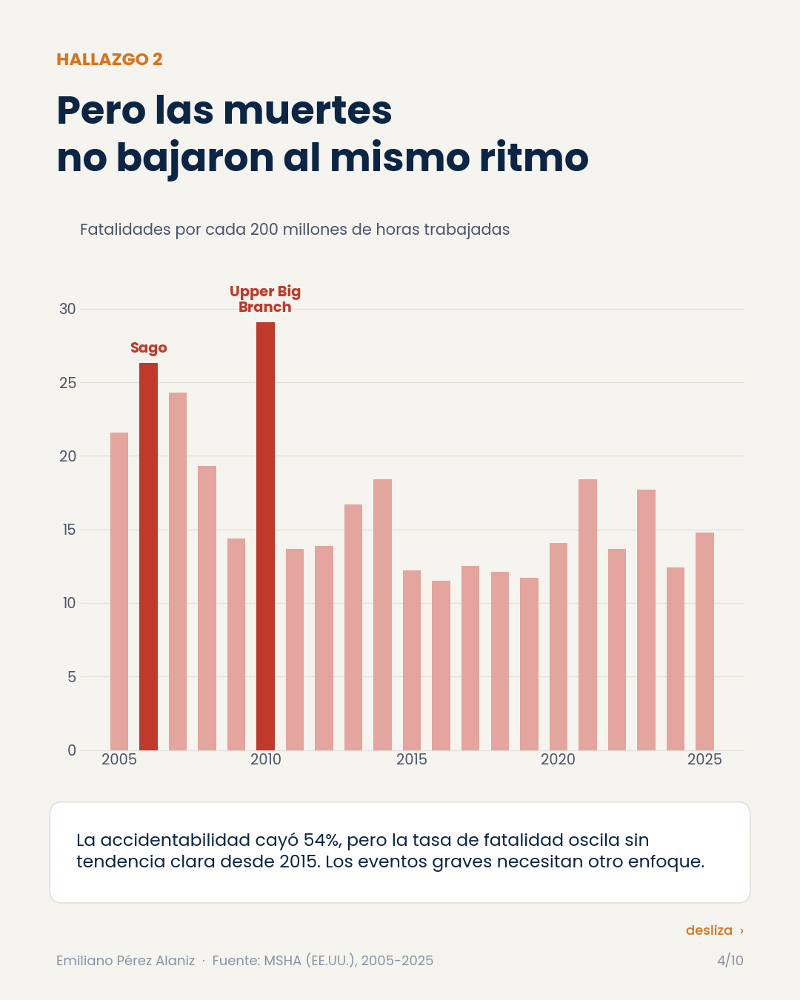
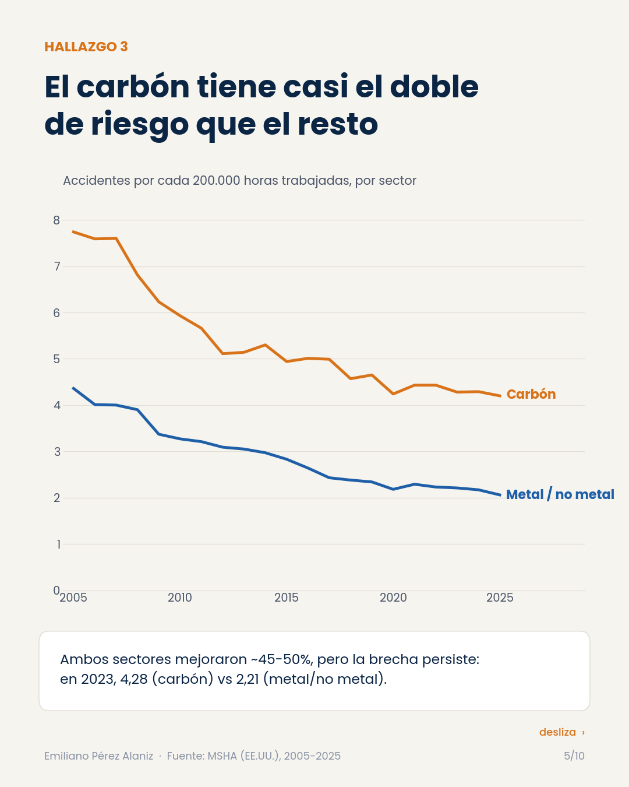
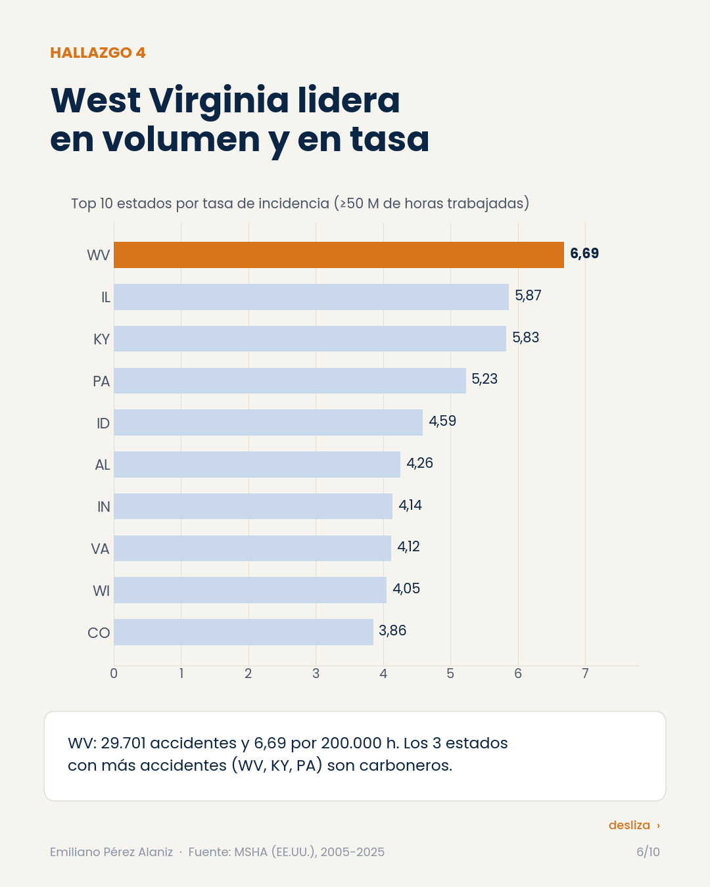
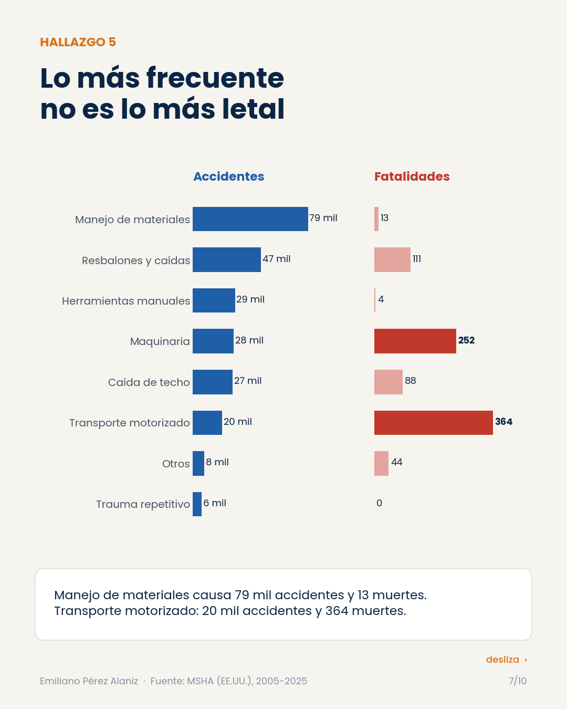
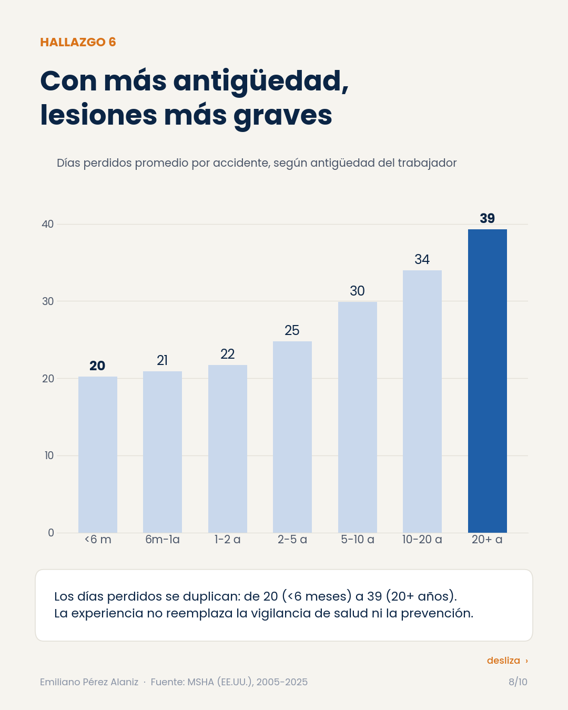
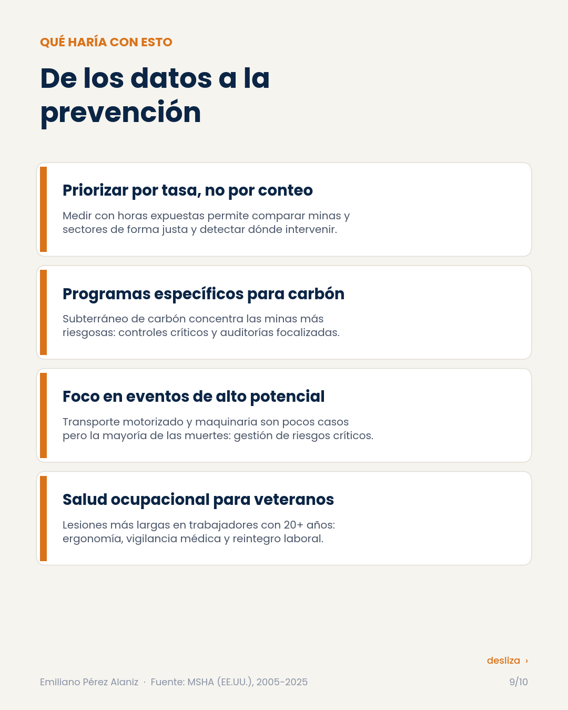
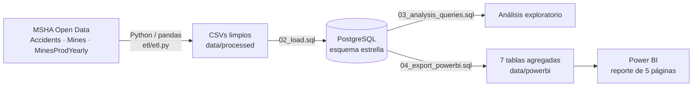

# ⛏️ Seguridad Minera en EE.UU. — Análisis de 20 años de accidentes (SQL + Power BI)

**190.000 accidentes · 853 fatalidades · 10.100 millones de horas trabajadas · 2005-2025**

Proyecto de *data analytics* aplicado a salud ocupacional y HSE: modelé en **PostgreSQL** los datos públicos de la
**Mine Safety and Health Administration (MSHA)** de EE.UU., calculé tasas normalizadas por exposición y construí un
reporte de 5 páginas en **Power BI** orientado a decisiones de prevención.

> 🇬🇧 *End-to-end analytics project on 20 years of US mine safety data (MSHA): Python ETL → PostgreSQL star schema →
> exposure-adjusted KPIs (per 200,000 hours worked) → 5-page Power BI report. Built by an occupational health & HSE
> professional with 5 years in large-scale mining.*

<p align="center"></p>

---

## 🔎 Hallazgos principales

| # | Hallazgo | Dato |
|---|----------|------|
| 1 | La tasa de accidentes cayó **54%** en 20 años | 5,50 → 2,51 por 200.000 h (2005 → 2025) |
| 2 | La tasa de **fatalidad no acompañó** esa mejora | Oscila sin tendencia clara desde 2015; picos en 2006 (Sago) y 2010 (Upper Big Branch) |
| 3 | El **carbón** tiene casi el **doble** de accidentes por hora que metal/no metal | 2023: 4,28 vs 2,21 |
| 4 | **West Virginia** lidera en volumen y en tasa | 29.701 accidentes · 6,69 por 200.000 h |
| 5 | Lo más frecuente **no es lo más letal** | Manejo de materiales: 79.033 accidentes / 13 muertes · Transporte motorizado: 20.181 / 364 |
| 6 | Más antigüedad, lesiones **más largas** | Días perdidos promedio: 20 (<6 meses) → 39 (20+ años) |

| | |
|---|---|
|  |  |
|  |  |
|  |  |

### 💡 Recomendaciones (mirada HSE)

1. **Priorizar por tasa, no por conteo** — medir contra horas expuestas permite comparar minas y sectores con justicia.
2. **Programas específicos para carbón subterráneo** — concentra las minas con mayor tasa.
3. **Gestión de riesgos críticos** — transporte motorizado y maquinaria son pocos casos pero la mayoría de las muertes.
4. **Salud ocupacional para trabajadores veteranos** — ergonomía, vigilancia médica y reintegro laboral.

<p align="center"></p>

---

## 🏗️ Arquitectura



### Modelo de datos (esquema estrella)

| Tabla | Tipo | Granularidad | Filas |
|-------|------|--------------|------:|
| `dim_mine` | Dimensión | una mina | 92.028 |
| `dim_date` | Dimensión | un día (incluye año fiscal MSHA) | 9.762 |
| `fact_accidents` | Hechos | un accidente reportado | 275.067 |
| `fact_mine_year` | Hechos | mina + año + subunidad (horas trabajadas) | 658.911 |

**Calidad de datos:** eliminación de registros sin fecha o con `document_no` duplicado, integridad referencial
forzada (0 accidentes y 0 registros mina-año huérfanos) y claves foráneas en el esquema.

### Métrica clave

```
Tasa de incidencia = accidentes / horas trabajadas × 200.000
```

200.000 horas equivalen a 100 trabajadores a tiempo completo durante un año: es el estándar de OSHA/MSHA y permite
comparar operaciones de distinto tamaño. Contar accidentes sin normalizar por exposición lleva a conclusiones erróneas.

---

## 📊 Reporte Power BI

| Página | Contenido |
|--------|-----------|
| 1. Tendencia nacional | KPIs, filtro por año, tasa de incidencia y tasa de fatalidad 2005-2025 |
| 2. Carbón vs Metal | Tasa de incidencia por sector |
| 3. Estados y causas | Top 15 estados y top 15 causas de accidentes |
| 4. Factores de riesgo | Accidentes por antigüedad y top 20 minas más riesgosas (≥500.000 h expuestas) |
| 5. Lesiones | Top 15 partes del cuerpo lesionadas |

Las 7 tablas del modelo semántico están en [`data/powerbi/`](data/powerbi) y se regeneran con
[`sql/04_export_powerbi.sql`](sql/04_export_powerbi.sql) (verificado: salida idéntica a los datos del reporte).

---

## ▶️ Cómo reproducirlo

```bash
# 1. Descargar de MSHA Open Government Data (msha.gov, sección "Data Sets"):
#    Accidents.txt, Mines.txt, MinesProdYearly.txt  ->  data/raw/
pip install pandas numpy openpyxl
python etl/etl.py data/raw                      # -> data/processed/*.csv

# 2. Base de datos
psql -f sql/01_schema.sql
psql -f sql/02_load.sql
psql -f sql/03_analysis_queries.sql             # análisis exploratorio
psql -f sql/04_export_powerbi.sql               # -> data/powerbi/*.csv

# 3. (Opcional) libro Excel para cargar en Power BI Service
python etl/build_powerbi_workbook.py            # -> data/MSHA_PowerBI_Data.xlsx
```

## 📁 Estructura

```
├── etl/
│   ├── etl.py                      # limpieza y modelado en pandas
│   └── build_powerbi_workbook.py   # CSVs -> Excel para Power BI
├── sql/
│   ├── 01_schema.sql               # esquema estrella + índices
│   ├── 02_load.sql                 # carga con \copy
│   ├── 03_analysis_queries.sql     # análisis + control de calidad
│   └── 04_export_powerbi.sql       # tablas del modelo de Power BI
├── data/powerbi/                   # 7 tablas agregadas (resultado)
└── docs/                           # carrusel e imágenes
```

## ⚠️ Limitaciones

- Los accidentes por antigüedad son **conteos**: MSHA no publica horas trabajadas por antigüedad, así que no se puede
  calcular una tasa por banda.
- Los datos reportados dependen del cumplimiento de la Parte 50 (30 CFR); puede haber subregistro.
- 2025 puede actualizarse con reportes tardíos.

## 👤 Autor

**Emiliano Pérez Alaniz** — Salud Ocupacional · HSE · Data Analytics
5 años en operaciones mineras de gran escala · Power BI · SQL · Python

*Datos: MSHA Open Government Data (dominio público, EE.UU.).*
